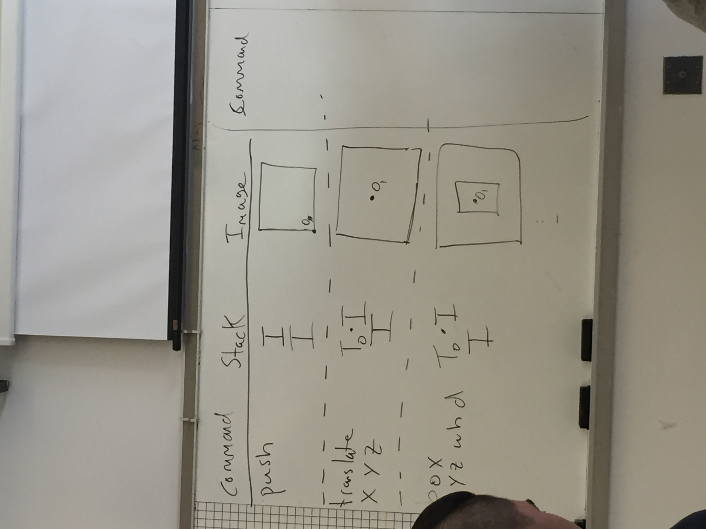
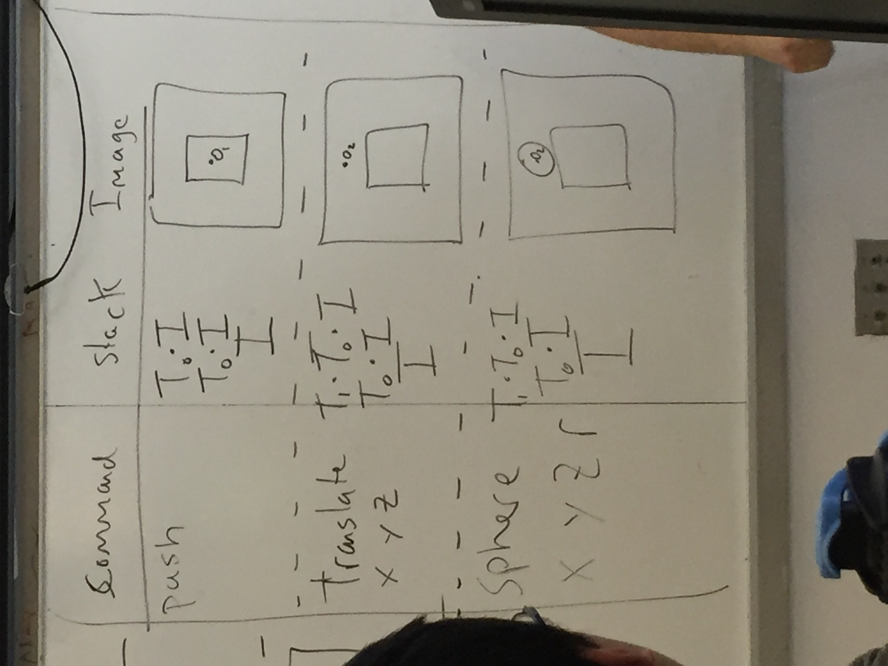

### Relative Coordinate System
- Currently we use a Global Coordinate System, which means each object is drawn with respect to the same origin / coordinate system

- But in a relative coordinate system, each object can have its own origin/coordinate
- We will use a stack to store the various coordinate systems

		P -> | 1 0 0 0 | -> P
			 | 0 1 0 0 |
		     | 0 0 1 0 |
			 | 0 0 0 1 |
	 
		P -> | 1 0 0 3 | -> P ( x + 3, y + 2 )
			 | 0 1 0 2 | 
			 | 0 0 1 0 |
			 | 0 0 0 1 |

### Graphics Framework
A. Transformations are applied to the top of the stack
B. The stack will be pushed and popped as needed
C. Drawing Pipeline: 
	1. Generate the points
	2. Multiply points by stack top
	3. Draw the object to the screen
	4. Clear the point matrix
	

